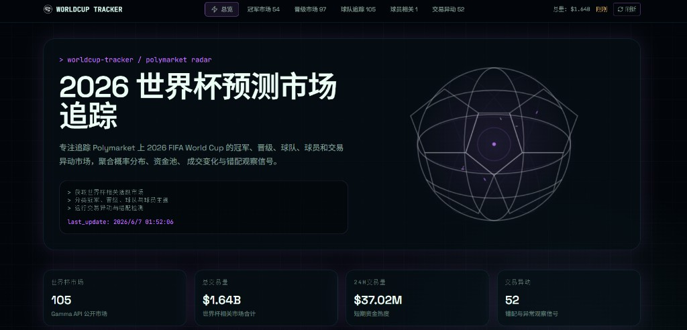

<p align="center">
  <a href="https://worldcup-tracker-lyart.vercel.app/" target="_blank"><strong>🌐 Live Demo</strong></a>
  ·
  <a href="#english">English</a>
  ·
  <a href="#中文">中文</a>
</p>

---

<a id="english"></a>

## English

# WorldCup Tracker

A real-time dashboard for **2026 FIFA World Cup** prediction markets on [Polymarket](https://polymarket.com). It aggregates market data via the public **Gamma API**, surfaces probability distributions, liquidity, volume trends, and heuristic mispricing signals.

**Live site:** https://worldcup-tracker-lyart.vercel.app/



### Features

- **Overview dashboard** — total markets, volume, 24h activity, and signal counts
- **Market sections**
  - Champion — outright winner markets
  - Advancement — qualification, knockout paths, and fixtures
  - Team — national team performance and outcomes
  - Player — awards, goals, injuries, and squad-related markets
  - Movement — volume spikes, price swings, and spread anomalies
- **Continental filters** — Europe, South America, Asia, Africa, North America
- **Sort options** — volume, liquidity, 24h volume, price change, signal score
- **Interactive hero** — 3D wireframe football visual on the homepage

### Tech Stack

| Layer | Stack |
|-------|-------|
| Framework | [Next.js](https://nextjs.org/) (App Router) |
| Language | TypeScript |
| Styling | Tailwind CSS |
| Data | Polymarket Gamma API (public, no API key required) |
| Deploy | [Vercel](https://vercel.com/) |

### Getting Started

```bash
git clone https://github.com/kaiyu96/worldcup-tracker.git
cd worldcup-tracker
npm install
npm run dev
```

Open [http://localhost:3000](http://localhost:3000).

**Scripts**

| Command | Description |
|---------|-------------|
| `npm run dev` | Start development server |
| `npm run build` | Production build |
| `npm run start` | Run production server locally |
| `npm run lint` | ESLint |
| `npm run typecheck` | TypeScript check |

### Deployment

No environment variables are required. Connect the GitHub repo to Vercel — it auto-detects Next.js.

See [DEPLOY.md](./DEPLOY.md) for the full first-time deployment checklist.

### Project Structure

```
app/           # Pages and API routes
components/    # UI components
lib/           # Classification, data fetching, signal scoring
docs/          # README assets
```

### Disclaimer

This project is for **informational and research purposes only**. It is not financial advice. Market data comes from Polymarket's public API and may be delayed or rate-limited. Always verify on Polymarket before making any decisions.

### License

Private / personal project. All rights reserved unless stated otherwise.

---

<a id="中文"></a>

## 中文

# WorldCup Tracker

面向 [Polymarket](https://polymarket.com) 上 **2026 FIFA 世界杯** 预测市场的实时追踪面板。通过公开 **Gamma API** 聚合市场数据，展示概率分布、资金池、成交变化与错配观察信号。

**在线地址：** https://worldcup-tracker-lyart.vercel.app/


### 功能特性

- **总览面板** — 市场数量、总交易量、24 小时成交、异动信号统计
- **市场分类**
  - 冠军市场 — 夺冠相关盘口
  - 晋级市场 — 出线、淘汰赛路径与赛程
  - 球队追踪 — 国家队表现与赛果
  - 球员相关 — 奖项、进球、伤病、阵容等
  - 交易异动 — 成交激增、概率大幅变化、流动性与价差异常
- **洲际筛选** — 欧洲、南美、亚洲、非洲、北美
- **多种排序** — 成交量、流动性、24h 成交、概率变化、信号分数
- **交互 Hero** — 首页 3D 线框足球动画

### 技术栈

| 层级 | 技术 |
|------|------|
| 框架 | [Next.js](https://nextjs.org/)（App Router） |
| 语言 | TypeScript |
| 样式 | Tailwind CSS |
| 数据 | Polymarket Gamma API（公开接口，无需 API Key） |
| 部署 | [Vercel](https://vercel.com/) |

### 本地运行

```bash
git clone https://github.com/kaiyu96/worldcup-tracker.git
cd worldcup-tracker
npm install
npm run dev
```

浏览器访问 [http://localhost:3000](http://localhost:3000)。

**常用命令**

| 命令 | 说明 |
|------|------|
| `npm run dev` | 启动开发服务器 |
| `npm run build` | 生产构建 |
| `npm run start` | 本地运行生产版本 |
| `npm run lint` | ESLint 检查 |
| `npm run typecheck` | TypeScript 类型检查 |

### 部署

无需配置环境变量。将 GitHub 仓库连接到 Vercel 即可，会自动识别 Next.js 项目。

完整首次部署步骤见 [DEPLOY.md](./DEPLOY.md)。

### 项目结构

```
app/           # 页面与 API 路由
components/    # UI 组件
lib/           # 分类规则、数据获取、信号评分
docs/          # README 资源文件
```

### 免责声明

本项目仅供**信息参考与研究**，不构成任何投资建议。数据来自 Polymarket 公开 API，可能存在延迟或限流。请以 Polymarket 官方页面为准。

### 许可证

私人 / 个人项目，保留所有权利。
